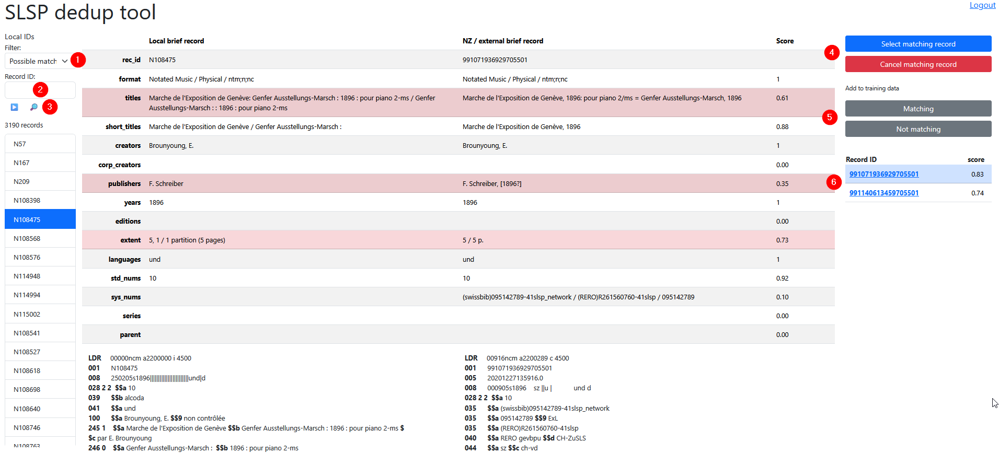

# SLSP deduplication tools
## Short manual
### Description
This project is a platform providing a tool for deduplication and
similarity evaluation of records.

It is useful to build training datasets for machine learning models.

### How to use it
The app need ready to use data in a MongoDB database. This data
needs to be built outside of the app. The app is only used to
evaluate the similarity between records.

Thresholds to decide if two records are similar can be set in the
app. They can be adjusted to get the best results.

Url: [https://serviceplatform.slsp.ch/dedup/](https://serviceplatform.slsp.ch/dedup/)

### Authentication
An SLSP admin can create an account for a user. The user can
then log in and use the app.

### Features

1. Filter, available options
   1. All: display all records
   2. Possible match: display records with a similarity score
      above a certain threshold
   3. Match: display records considered as matching with a NZ record
   4. No match: display records not considered as matching with a NZ record
   5. Duplicate match: display records considered as matching with
      more than one record
2. Search for a record by its record ID
3. Triangle button: display the next 20 records according to the filter;
    Magnifying glass button is used to start the record ID search
4. Buttons to select or deselect a record as a matching NZ record.
5. Buttons to send a record to the training set.
6. List of possible matches with the similarity score. The star indicates
    a selected NZ record as a match.

### How to create training datasets
We need to be very careful when creating training datasets. We absolutely
need to avoid any extreme cases. The system only evaluates the similarity
between scores of the various fields of the briefrecords.

Exceptional data will cause the system to overfit to these special cases.
In the end, the result could be really bad, even with only a few bad
records in the training set.

The idea is to help the system how to ponder the various fields of the
briefrecords. The system will then be able to evaluate the similarity
with more precision.